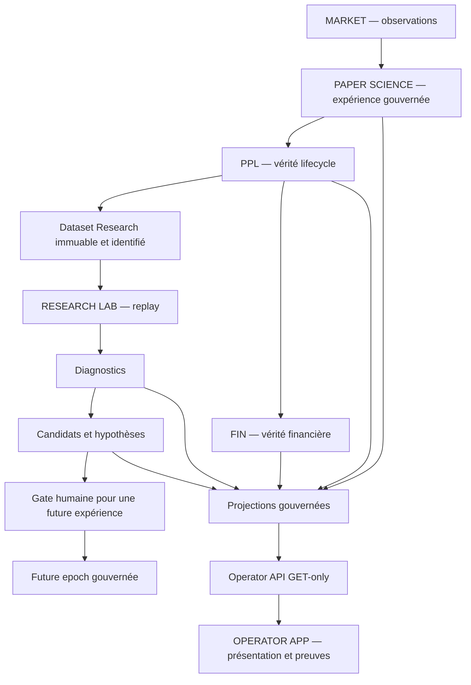

# Crypto AI Terminal

**Quantitative Research Infrastructure**

Crypto AI Terminal relie l'observation du marché, une expérience PAPER,
la vérité lifecycle et financière, la recherche reproductible et une application
opérateur. Le projet sépare les producteurs de faits, les hypothèses Research
et les autorités de décision.

> **SOURCE STATE ≠ DEPLOYED RUNTIME STATE**
>
> Un merge, un test vert ou une capture UI ne prouve pas un déploiement.
> Le burn-in est protégé par [#286](https://github.com/3a7i3/crypto-ia-terminal/issues/286).
> Cette documentation n'autorise aucun changement de la machine active.

L'app présente deux espaces : **Machine**, pour comprendre l'expérience,
les services, le portefeuille, les finances, le burn-in et CryptoRadar ;
**Laboratoire quantitatif**, pour consulter datasets, évaluations, diagnostics,
candidats et critères des stratégies. Les verdicts et classements proviennent
de publications Research identifiées. Le frontend ne les calcule pas et ne
possède aucune autorité de trading.

## Commencer ici

| Besoin | Entrée canonique |
|---|---|
| Développer ou reprendre le projet | [docs/DEVELOPER_ENTRYPOINT.md](docs/DEVELOPER_ENTRYPOINT.md) — lire en premier |
| Règles pour les agents et contributeurs | [CLAUDE.md](CLAUDE.md) |
| Mission de cette tranche | [CURRENT_TASK.md](CURRENT_TASK.md) — pointeur, pas roadmap |
| Priorisation actuelle | [#285 — MASTER ROADMAP II](https://github.com/3a7i3/crypto-ia-terminal/issues/285) |
| Cockpit produit | [#323 — APP-UNIFY](https://github.com/3a7i3/crypto-ia-terminal/issues/323) |
| Burn-in et garde-fou | [#282 — observations](https://github.com/3a7i3/crypto-ia-terminal/issues/282), [#286 — freeze](https://github.com/3a7i3/crypto-ia-terminal/issues/286) |
| Chronologie, sans autorité runtime | [ROADMAP.md](ROADMAP.md), [#148 — roadmap historique](https://github.com/3a7i3/crypto-ia-terminal/issues/148) |

## Frontières du code

| Domaine | Sources principales | Autorité / rôle |
|---|---|---|
| Market Observatory | `market_data/`, `trade_analysis/`, producteurs CryptoRadar | observations de marché, sans permission d'exécution |
| PAPER Science | `core/advisor_loop.py`, `paper_trading/` | orchestration de l'expérience ; PPL porte le lifecycle |
| Financial Institute | `financial_institute/` | vérité financière, pas recomputation UI |
| Research Lab | `research_data/`, `research_replay/`, `research_diag/`, `research_candidate/` | datasets immuables, analyse et hypothèses non autoritaires |
| Operator API / App | `observability/operator_api/`, `frontend/` | projections GET-only, présentation et provenance |
| Governance | `governance/`, contrats, missions GitHub | admissions, limites et décisions explicites |

La présence de modules historiques ou de trois arbres `runtime/` ne prouve
pas leur activation. Ne pas lancer les anciens dashboards ou launchers pour
« démarrer tout le projet ». Les sorties internes JSONL, logs, datasets et
sauvegardes restent des preuves ; elles ne sont pas des interfaces concurrentes
à supprimer.

## État source de référence

Synchronisation DOC-CANON-02 du 2026-10-04 depuis
`main@a057d4e972cd60ee32710d59f327b4185f3af287`.

La chaîne Machine Maturity est désormais formellement certifiée jusqu'à
**L1 — Observable Machine**. Le certificat canonique L1 v2 porte le hash
`49d112260450cd3d34802e50aebbd3abd1922718f8cc9b789e81b8dc074e91cf`;
il lie explicitement L0 comme prédécesseur et conserve le premier certificat L1
comme historique superseded. L2 et L3 sont `READY_FOR_REVIEW`, pas certifiés.
L4 reste `IN_PROGRESS`.

Côté produit, les tranches APP-UNIFY déjà fusionnées couvrent notamment
Machine/Laboratoire, burn-in/services, Scanner, LMI détaillé, Research, Events
et Stockage. Elles restent des preuves source. La certification globale U7
`APP_UNIFY_01_SOURCE_CERTIFIED` n'est pas encore émise et U8 runtime reste
une gate séparée.

Le burn-in #282 n'est pas finalisé et #286 demeure
`ACTIVE_BURN_IN_IMMUTABILITY_GUARD`. La référence runtime consignée reste
`116634be…` ; cette page ne crée aucune observation VPS fraîche. #315 Gate O
reste ouvert et OperatorDecision opérationnel demeure non déployé.

Les PR administratives obsolètes #373 et #345 sont fermées sans merge ;
#374 Agent Registry reste parquée en DRAFT/source-only. Les états et preuves
GitHub datés priment toujours sur ce résumé.

Voir le [plan Machine/Lab](docs/plans/APP_UNIFY_MACHINE_LAB_PRODUCT_PLAN.md),
[l'inventaire de capacités](docs/plans/APP_UNIFY_FUNCTIONS_AND_OUTPUTS_INVENTORY.md)
et les [contrats](docs/contracts/). Pour les commandes locales et les contrôles,
utiliser l'entrée développeur plutôt qu'un ancien runbook runtime.

L'ancien README V9.1 et ses mentions « production-ready » sont conservés dans
[l'historique immuable de cette base](https://github.com/3a7i3/crypto-ia-terminal/blob/053c8540a012b2c2c7a9bc5e76585a1425858f73/README.md),
comme matériau historique, sans autorité actuelle.
