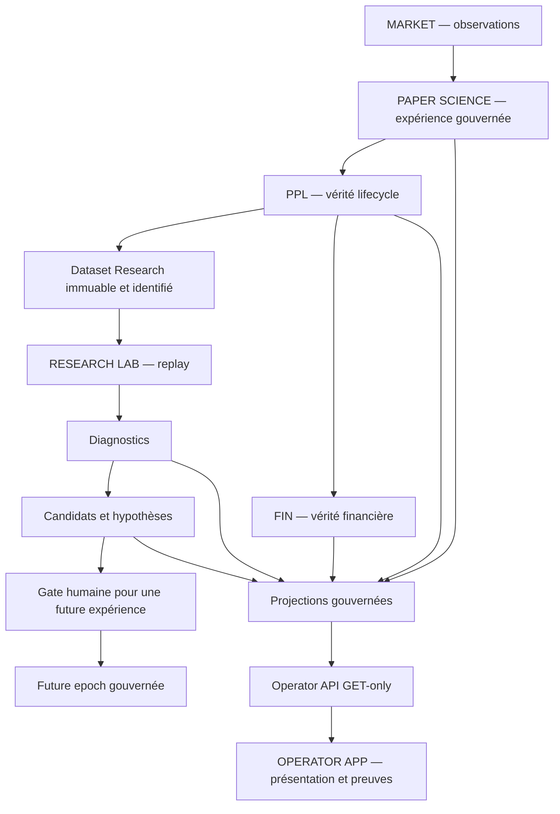

# Crypto AI Terminal

**Quantitative Research Infrastructure**

Crypto AI Terminal relie l'observation du marché, une expérience PAPER,
la vérité lifecycle et financière, la recherche reproductible et une application
opérateur. Le projet sépare les producteurs de faits, les hypothèses Research
et les autorités de décision.

> **SOURCE STATE ≠ DEPLOYED RUNTIME STATE**
>
> Un merge, un test vert ou une capture UI ne prouve pas un déploiement.
> Le burn-in est protégé par [#286](https://github.com/3a7i3/crypto-ia-terminal/issues/286).
> Cette documentation n'autorise aucun changement de la machine active.

L'app présente deux espaces : **Machine**, pour comprendre l'expérience,
les services, le portefeuille, les finances, le burn-in et CryptoRadar ;
**Laboratoire quantitatif**, pour consulter datasets, évaluations, diagnostics,
candidats et critères des stratégies. Les verdicts et classements proviennent
de publications Research identifiées. Le frontend ne les calcule pas et ne
possède aucune autorité de trading.

## Commencer ici

| Besoin | Entrée canonique |
|---|---|
| Développer ou reprendre le projet | [docs/DEVELOPER_ENTRYPOINT.md](docs/DEVELOPER_ENTRYPOINT.md) — lire en premier |
| Règles pour les agents et contributeurs | [CLAUDE.md](CLAUDE.md) |
| Mission de cette tranche | [CURRENT_TASK.md](CURRENT_TASK.md) — pointeur, pas roadmap |
| Priorisation actuelle | [#285 — MASTER ROADMAP II](https://github.com/3a7i3/crypto-ia-terminal/issues/285) |
| Cockpit produit | [#323 — APP-UNIFY](https://github.com/3a7i3/crypto-ia-terminal/issues/323) |
| Burn-in et garde-fou | [#282 — observations](https://github.com/3a7i3/crypto-ia-terminal/issues/282), [#286 — freeze](https://github.com/3a7i3/crypto-ia-terminal/issues/286) |
| Chronologie, sans autorité runtime | [ROADMAP.md](ROADMAP.md), [#148 — roadmap historique](https://github.com/3a7i3/crypto-ia-terminal/issues/148) |

## Frontières du code

| Domaine | Sources principales | Autorité / rôle |
|---|---|---|
| Market Observatory | `market_data/`, `trade_analysis/`, producteurs CryptoRadar | observations de marché, sans permission d'exécution |
| PAPER Science | `core/advisor_loop.py`, `paper_trading/` | orchestration de l'expérience ; PPL porte le lifecycle |
| Financial Institute | `financial_institute/` | vérité financière, pas recomputation UI |
| Research Lab | `research_data/`, `research_replay/`, `research_diag/`, `research_candidate/` | datasets immuables, analyse et hypothèses non autoritaires |
| Operator API / App | `observability/operator_api/`, `frontend/` | projections GET-only, présentation et provenance |
| Governance | `governance/`, contrats, missions GitHub | admissions, limites et décisions explicites |

La présence de modules historiques ou de trois arbres `runtime/` ne prouve
pas leur activation. Ne pas lancer les anciens dashboards ou launchers pour
« démarrer tout le projet ». Les sorties internes JSONL, logs, datasets et
sauvegardes restent des preuves ; elles ne sont pas des interfaces concurrentes
à supprimer.

## État source de référence

Reconstruction DOC-CANON-01 du 2026-10-02 depuis
`053c8540a012b2c2c7a9bc5e76585a1425858f73` : U4 Research (#337) et la tranche
Machine/Laboratoire (#339, mission #338 terminée) sont fusionnés en source.
Cela inclut Scanner, LMI, projections burn-in/services et tableau passif des
stratégies. L'admission des vrais résultats Lab, les écarts de parité CryptoRadar
et la certification globale U7 restent distincts. Les captures de test ne sont
pas des résultats de production.

La référence runtime consignée sous #286 demeure `116634be…` ; cette page
ne fait aucune nouvelle observation VPS. Les références complètes et la méthode
pour vérifier la fraîcheur d'une preuve sont dans l'entrée développeur.
La publication U8 et le retrait du dashboard standalone exigent leurs gates.
[#315 Gate O](https://github.com/3a7i3/crypto-ia-terminal/issues/315) reste ouvert ;
le prototype source n'est pas une file de décisions opérationnelles.

Voir le [plan Machine/Lab](docs/plans/APP_UNIFY_MACHINE_LAB_PRODUCT_PLAN.md),
[l'inventaire de capacités](docs/plans/APP_UNIFY_FUNCTIONS_AND_OUTPUTS_INVENTORY.md)
et les [contrats](docs/contracts/). Pour les commandes locales et les contrôles,
utiliser l'entrée développeur plutôt qu'un ancien runbook runtime.

L'ancien README V9.1 et ses mentions « production-ready » sont conservés dans
[l'historique immuable de cette base](https://github.com/3a7i3/crypto-ia-terminal/blob/053c8540a012b2c2c7a9bc5e76585a1425858f73/README.md),
comme matériau historique, sans autorité actuelle.
