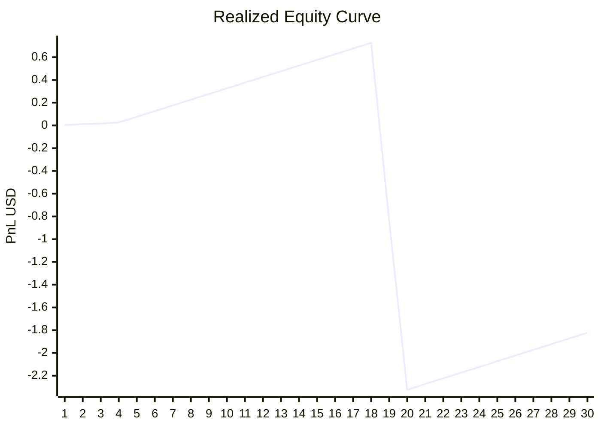

# Dashboard Intelligence

_Last update: 2026-05-12T23:19:47.291666+00:00_

## Performance
- Trades: 36
- Total PnL: -1.25
- Winrate: 94.44%
- Expectancy: 0.0389

## Surveillance (Drift & Dégradation)
- Score drift: z=0.00 (stable) ✅
  baseline=0.0000 | recent=0.0000 | n_baseline=39 | n_recent=10
- Winrate rolling 20: 90.0% ✅

## Robustesse (KPIs fiables production)
> ⚠️ ALERTE asymétrie : winrate=94.4% mais PnL=-1.25$ — les pertes coûtent trop cher par rapport aux gains. Vérifier avg_loss vs avg_win.

- Profit factor: 23.9419 ✅
- Avg win/loss ratio: 1.4083 ⚠️
- Worst trade: -3.12% (-1.56$)
- Drawdown normalisé: 0.30% (ref capital: 1000$) ✅
  _(normalisé sur capital de référence — fiable en production)_
- Rolling 20 trades: 20 trades | winrate=90.00% | expectancy=0.0420

## Trade Quality
- Avg MFE: 4.08%
- Avg MAE: -0.20%
- Efficiency: 99.32%

## Equity Curve
> ⚠️ Drawdown ci-dessous calculé sur courbe PnL réalisé (exploratoire). Voir "Drawdown normalisé" ci-dessus pour le KPI fiable.
- Last equity: -1.82
- Peak equity: 0.73
- Current drawdown: 2.55
- Max drawdown: 3.05 (419.97%)
- Points: 30

## Regime State
- bull_trend: 33 trades | winrate=100.00% | avg pnl=4.39%
- bullish: 1 trades | winrate=100.00% | avg pnl=1.00%
- sideways: 2 trades | winrate=0.00% | avg pnl=-3.05%

## Optimizer State
### bull_trend
- TP: 0.012
- SL: 0.008
- Trailing: 0.004
- Score: 0.043939
- Winrate: 100.00%
### bullish
- TP: 0.012
- SL: 0.008
- Trailing: 0.004
- Score: 0.020000
- Winrate: 100.00%
### sideways
- TP: 0.012
- SL: 0.008
- Trailing: 0.004
- Score: -0.000000
- Winrate: 0.00%
