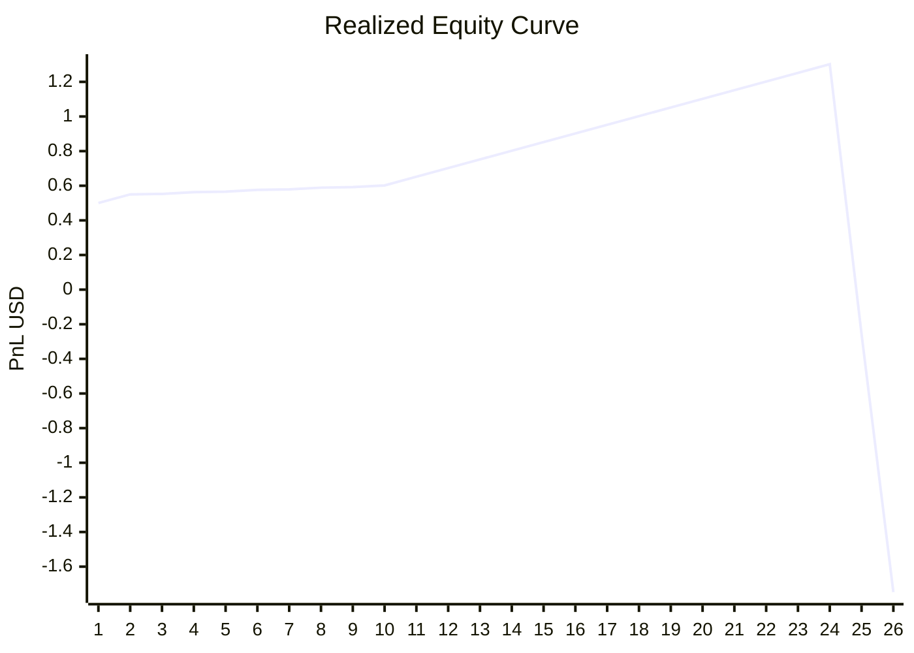

# Dashboard Intelligence

_Last update: 2026-05-06T04:56:41.729129+00:00_

## Performance
- Trades: 26
- Total PnL: -1.75
- Winrate: 92.31%
- Expectancy: 0.0346

## Trade Quality
- Avg MFE: 3.73%
- Avg MAE: -0.27%
- Efficiency: 98.97%

## Equity Curve
- Last equity: -1.75
- Peak equity: 1.30
- Current drawdown: 3.05
- Max drawdown: 3.05 (234.18%)
- Points: 26

## Regime State
- bull_trend: 23 trades | winrate=100.00% | avg pnl=4.13%
- bullish: 1 trades | winrate=100.00% | avg pnl=1.00%
- sideways: 2 trades | winrate=0.00% | avg pnl=-3.05%

## Optimizer State
### bull_trend
- TP: 0.012
- SL: 0.008
- Trailing: 0.004
- Score: 0.041304
- Winrate: 100.00%
### bullish
- TP: 0.012
- SL: 0.008
- Trailing: 0.004
- Score: 0.020000
- Winrate: 100.00%
